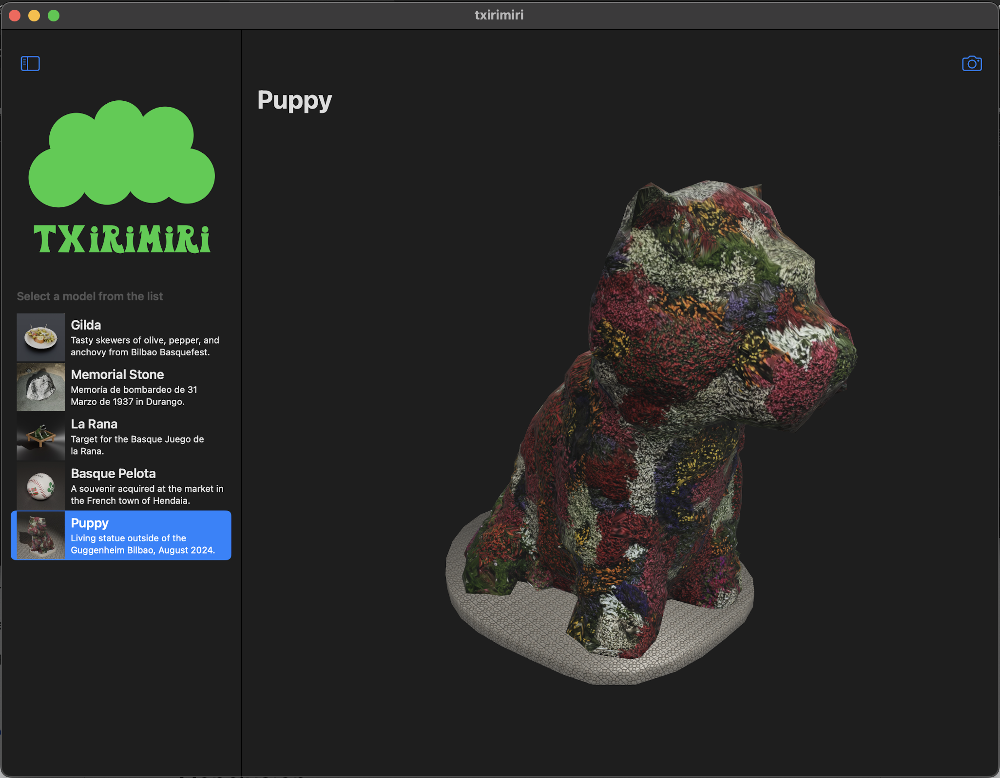
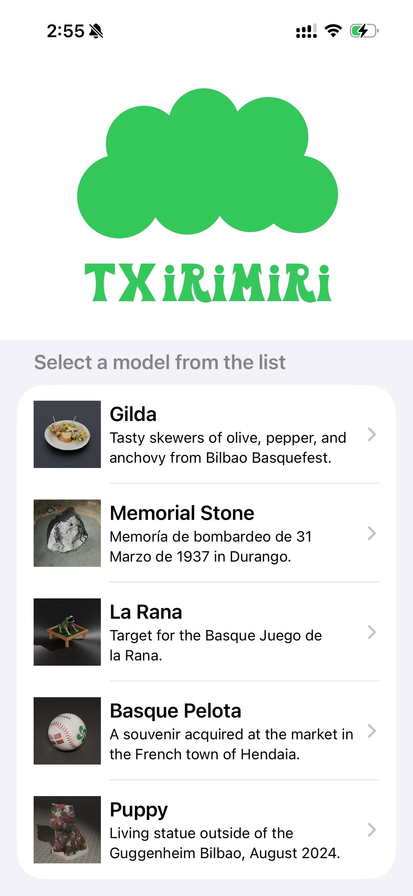
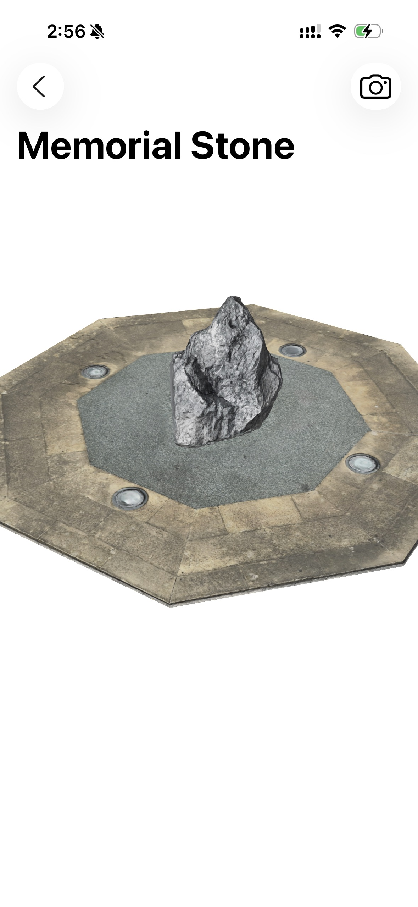
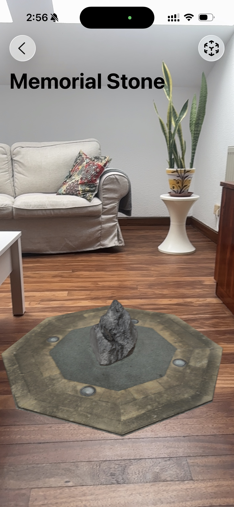

#  

_Host 3D models in USDZ format on CloudKit for an iOS app._

   

This repository is a companion to a [tutorial on the DC-Engineer.com blog](https://www.dc-engineer.com/how-to-host-3d-usdz-content-in-icloud-for-an-ar-app-using-cloudkit-realitykit-and-swiftui/).
In that tutorial, I explain the methods and code used to generate a CloudKit container for 3D models and associated data, and then fetch that data at run time for viewing in augmented reality (AR).
RealityKit and SwiftUI frameworks are used for 3D rendering and creation of native controls.

## Web Version

After writing the original article, I have learned about how to access the same iCloud data from JavaScript.
I am hosting a simple website that demonstrates this, using `.glb`-formatted files, and Google's [ModelViewer](https://modelviewer.dev/).

### [Txirimiri Web App](https://txirimiri.vercel.app/)

## Key Steps and Lessons-Learned

If you follow along with the tutorial, you will be introduced to the following:
1. Setting up the initial app template to use CloudKit, adding the [entitlements file](https://github.com/radcli14/txirimiri/blob/main/txirimiri/txirimiri/txirimiri.entitlements), and enabling permissions.
2. Building your model schema through your browser in the CloudKit console, and adding a 3D model.
3. Creating a [content manager](https://github.com/radcli14/txirimiri/blob/main/txirimiri/txirimiri/ContentManager.swift) to fetch data and [convert to an entity](https://github.com/radcli14/txirimiri/blob/main/txirimiri/txirimiri/Model3DView%2BViewModel.swift) for use in your app at runtime.
4. Adding the content to a [3D scene in RealityKit](https://github.com/radcli14/txirimiri/blob/main/txirimiri/txirimiri/Model3DView.swift). 
